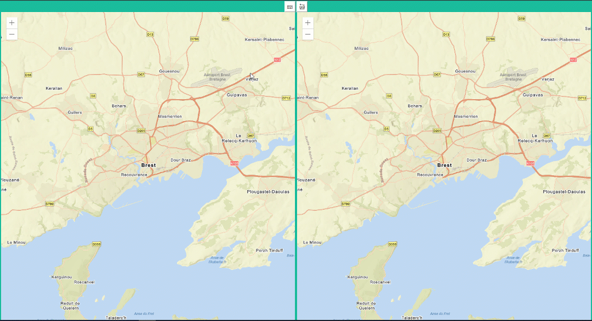

# ArcGIS API for JavaScript 4.x & React Hook, useReducer, Context




This is an example of an appliction wich use the ArcGIS API for JavaScript, ArcGIS Webpack Plugin with React. There are 3 components : a header with toolbar and two map views.

With the toolbar, you can activate distance measurement or area measurement. The pattern use for this application is hook, reducer and context.

## Installation

### Clone

- Clone this repo to your local machine using `https://github.com/qQsss777/arcgis-react-hook-context-reducer.git`

### Setup

It requires the installation of:
- TypeScript : https://www.typescriptlang.org/index.html#download-links

```shell
$ npm install -g typescript
$ npm install
```

Launch the dev server to test the application :

```shell
$ npm start
```

---

## License
[](https://opensource.org/licenses/Apache-2.0)
